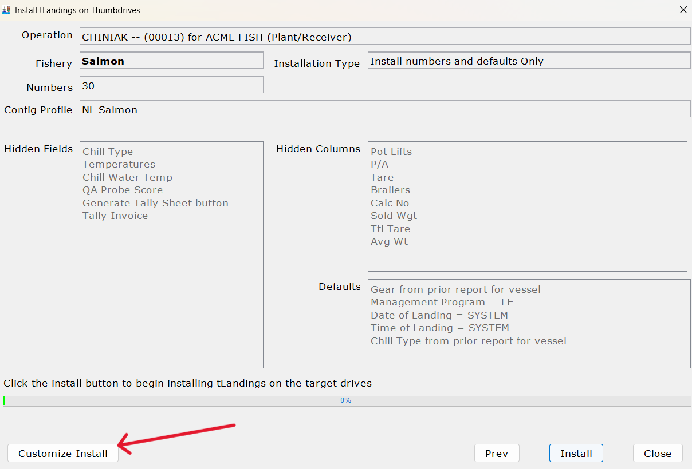
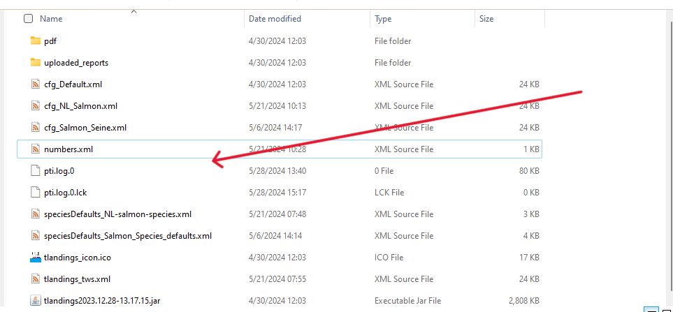

# Configuration profiles for eLandings
this directory includes configuration profiles which can be downloaded for importing into eLandings. Once a profile has been imported it can then be used to configure USB drives to be distributed to Tenders.

## config profile
[configuration profile](../config/cfg_NL_Salmon.xml) for the Hannah operation supplied to a specified tender, contains information for the bulk of the fish ticket.

## species defaults
[species defaults](../config/speciesDefaults_NL-salmon-species.xml) this is a subsidiary configuration profile for an operation profile on a given tender, contains fish species as well as product and condition codes.

## importing a confg profile
start by downloading the <a href="https://github.com/purpleponker/Northline_eLandings/raw/main/data/config.zip" download="config.zip"> config profile </a> folder which contains all the profiles available, or download a specific profile above using the download button in the file locations upper right tab bar.
- start by seleting the Northline Operation and selecting a Tender
- click 'Customize Install' button, then 'Manage Files' followed by the 'Install Files' and then finally click 'Ok'

- drag and drop the desired profiles into the file explower browser for the PTI program, be sure NOT to drop the files into one of the internal folders

