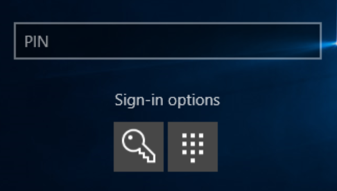
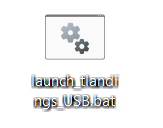
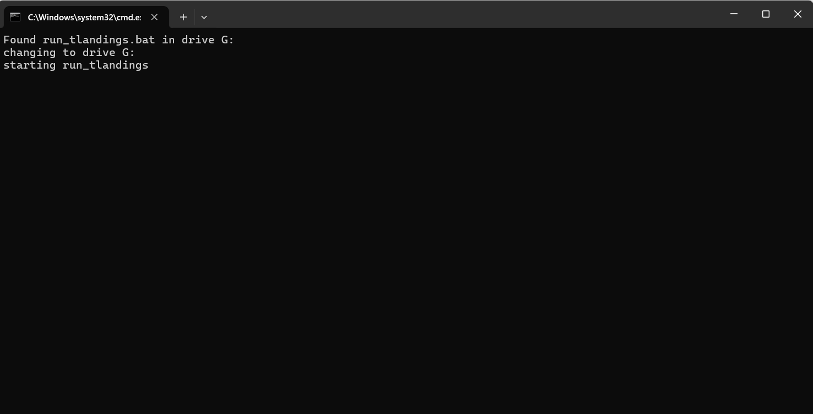
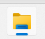
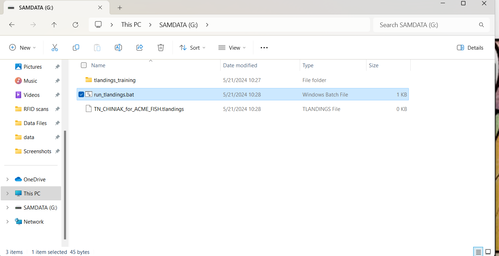
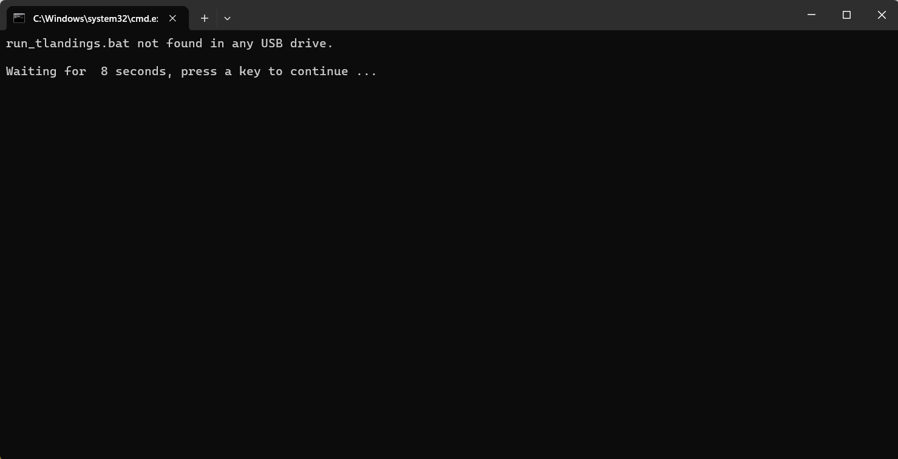
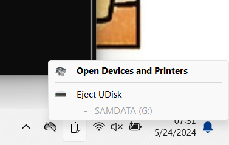
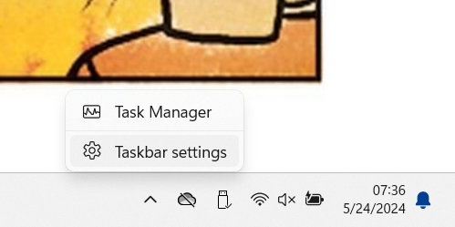
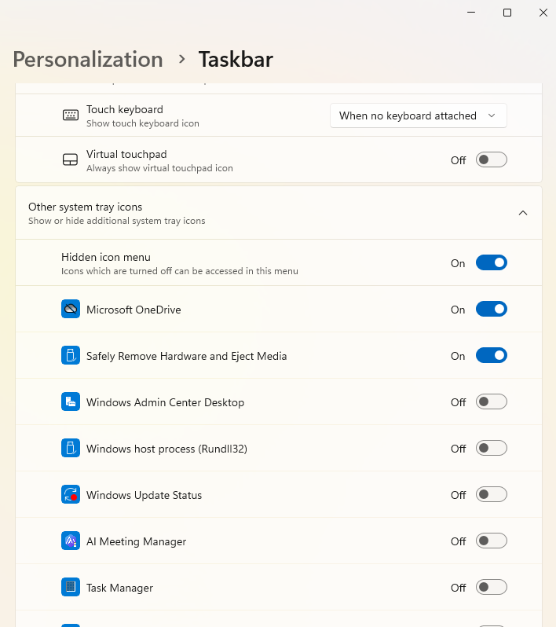

# tLandings quick guide

> This is a quick guide for tLandings, including laptop sign in information and tLandings initial set up

<!-- toc -->

- [laptop start up](#laptop-startup)
  * [login info](#login-info)
- [launch tLandings](#launch-tLandings)
  * [recommended](#recommended-method)
  * [manual launch](#manual-launch)
- [launcher failed](#launcher-failed)
  * [failed launch troubleshooting](#failed-launch-troubleshooting)
- [closing](#closing)

## laptop startup
login options are two-fold: the recomended option is to use the PIN which is northline.
If for some reason the PIN is not working or the sign-in options switch to password you can login with password: Northline1

### login info:

PIN - northline

Password - Northline1

the two sign in options can be accessed below the text box to change sign in options, the default option is to use the PIN

## launching tLandings

### recommended method
on the desktop screen is an icon called 'launch_tLandings_USB.bat' double click the program icon which will scan for the tLandings executable installed on USB drives. Successful scans for the executable results in displaying a brief message on the terminal and launching the executable. The message will display for 5 seconds before timeing out and closing.

*Please note on your first launch of tLandings the program may have a slight delay while launching, however if your terminal message was a successful scan return then the program will launch after initializtion and loading.

### manual launch
alternatively if the launcher does not work or you would rather manually launch tLandings: first navigate to the file explorer icon on the task bar(you can search for 'file explorer' in the search bar as well)

next find the USB drive connected in the 'This PC' section of the left panel, and finaly execute the run_tLandings.bat file.

*note if manual launch is the desired method I would recommend turning on the automatically open file explorer option in auto play settings for removable drives

## launcher failed
if the launcher fails to find the tLandings execution on a USB it will respond as such via message on the terminal which will timeout after 10 seconds and close.

### failed launch troubleshooting
- attempt the [manual launch](#manual-launch) option
- ensure USB is pluged in and has been configured with tLandings
- if USB is plugged in but not appearing it may been ejected either by mistake or accidentally, so unplug and replug the USB drive in.
  
## closing
when closing tLandings and removing the USB drive you should be sure to eject the drive using the USB taskbar icon in the bottom right in order to ensure data is not corrupted before removing the USB drive.

if the USB icon does not appear on the task bar right clik on the task bar and select 'task bar settings'

once in the settings menus click on the 'Other system tray icons' and ensure the 'Safely Remove Hardware and Eject Media' toggle is on

[return to top](#tLandings-quick-guide)

