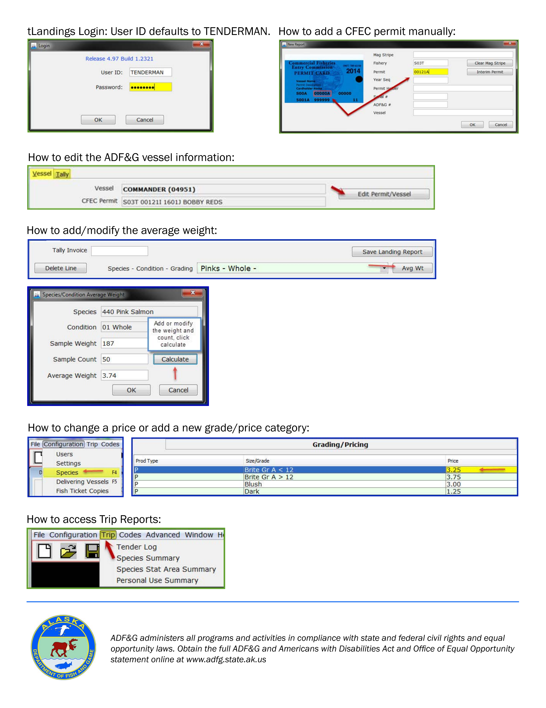

## tLandings configuration and sign in

### log in
login is done simply by using the supplied Tender User ID along with your designated password

### generating a fish ticket
will implement once eLandings login credentials are established

follow the instructions below for generating a fish ticket

### importing tickets to eLandings
- uploading tloadings reports to elandings from the PTI

more uploading instructions can be see [here](https://elandings.atlassian.net/wiki/spaces/doc/pages/501285690/Uploading+Groundfish+Tickets+from+tLandings+with+the+PTI+into+eLandings)

[return to home](https://github.com/purpleponker/Northline_eLandings/blob/main/README.md)
